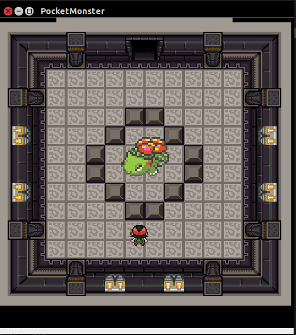
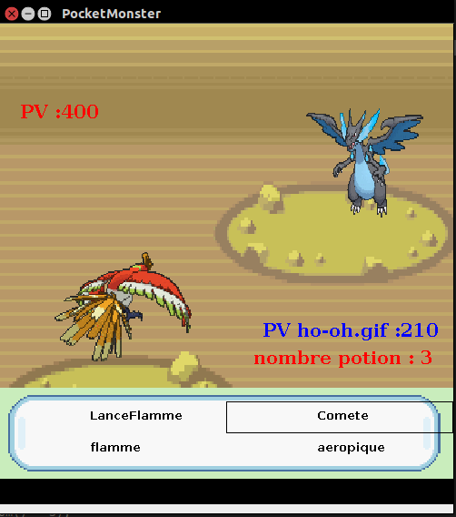

# pokemon
Voici un mini jeu Pokemon programme en 5 jours pour un concours entre camarades. 
Le jeu est programme en java  

Le jeu est moins aboutis que <em>GOLDEN SUN CHAPTER I</em>(adresse :github.com/chenpatrick/GoldenSunD) mais il a son charme 

#lancer le jeu
Lancer le jeu grace au .exe ou .jar.(Avec ou sans son a vous de choisir)

#Histoire

RED est mort ,un musée est cree ,mais il est hante ,en effet ,les pokemons de red ont ete empaille et transforme  
En statut de pierre ,leurs ames ne sont pas en paix .... 
Vous incarnerez donc Ash(Sahca Ketchum)  et vous devez aider ses pokemons a trouver le salut en les defonçant. 
Pour cela ,vous combattez leurs esprits un par un.

#Les Pokemons
Les votres : HO-OH ,Lugia ,Mewtwo 
Les pokemons de RED sont 8.

#boutons
Bouton r = accelerer le texte  
Bouton s = ralentir le texte 
Bouton p = donner une potion a toute l'equipe 
Bouton m,l,o, = Pendant un combat change de pokemon (o = ho-oh ,l= lugia ,m = mewtwo) 

#ecran dejeu
en mode rpg , 2 ecrans de jeu : 

